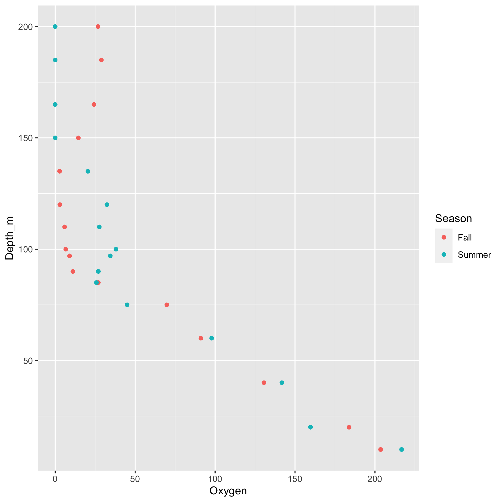

# Section 1

Some text.

Here is another paragraph.

## Subsection 

Some more text. 
Some *italics* text; some **bold** text.

Here is some code: `1+1 = 2`.

We can have a [link](www.rstudio.com).



### How to create lists
- first element
- second element
	- sub-item 1
	- sub-item 2
	
Inline formula: $a_1^2+a_2^2=a_3^2$.

Here is how to write a display formula:

$$\bar{x} = \frac{1}{n} \sum_{i=1}^n x_i$$

# Code chunks
A code chunk is formatted as:

```{r include=FALSE}
library(tidyverse)
dat <- read.csv("data.csv")
```

We obtained geochemical data from `r nrow(dat)` samples, `r nrow(filter(dat, Add_data == TRUE))` of which had corresponding microbial data.